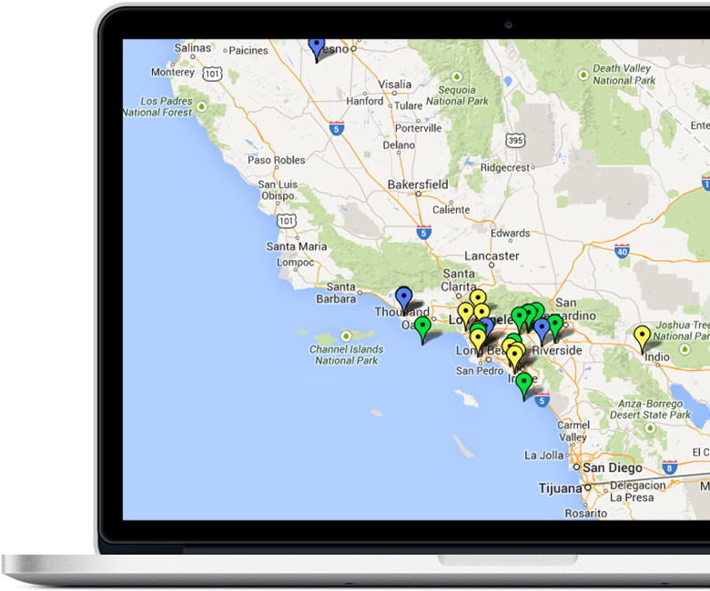

<!DOCTYPE html>
<html lang="en">
<head>
    <meta charset="utf-8">
    <title>TANKAPP</title>
    <link rel="stylesheet" href="style.css">
</head>
<body>
    <header>
        

            

            <nav class="menu-1">
                <ul class="menu-one">
                    <li>
                        <a href="#">How it works</a>
                    </li>
                    <li>
                        <a href="#">About Us</a>
                    </li>
                    <li>
                        <a href="#">Contact Us</a>
                    </li>
                    <li>
                        <a href="#">Blog</a>
                    </li>
                </ul>
            </nav>
        

    </header>
    <section id="block-1">
        

            

                

                    
                

                

                    <h1>Track your next
                     fuel shops</h1>
                    
Monitor and Alert on all petrol bunks near to you 
     
                

                

                    
Signup For

                    

                        <a class="button-1" href="#">Free</a>
                    

                

                

                    <form>
                        <input type="Your E-mail  Adress" placeholder="Your E-mail Address">
                    </form>
                    

                        <a class="button-2" href="#">SIGNUP</a>
                    

                

                

                    
                

            

            

                
            

        

    </section>
    <section id="block-2">
        

            <nav class="menu-imege">
                <ul class="menu-imege-1">
                    <li>
                        
                    </li>
                    <li>
                        
                    </li>
                    <li>
                        
                    </li>
                    <li>
                        
                    </li>
                    <li>
                        
                    </li>
                </ul>
            </nav>
        

    </section>
    <section id="block-3">
        

            
WHY Tank App ?

                

                

                
<h3>Reliable and Secure Platform</h3>

                

                    <h2 class="x-class">
                         Lorem ipsum dolor sit amet, consectetur adipisicing elit, sed do eiusmod 
                         tempor incididunt ut labore et dolore magna aliqua. Ut enim ad minim 
                         veniam, quis nostrud exercitation ullamco laboris nisi ut aliquip ex ea com
                    </h2>
                

                

                
<h3>Reliable and Secure Platform</h3>

                

                    <h2>
                         Lorem ipsum dolor sit amet, consectetur adipisicing elit, sed do eiusmod 
                         tempor incididunt ut labore et dolore magna aliqua. Ut enim ad minim 
                         veniam, quis nostrud exercitation ullamco laboris nisi ut aliquip ex ea com
                    </h2>
                

                

                
<h3>Reliable and Secure Platform</h3>

                

                    <h2>
                         Lorem ipsum dolor sit amet, consectetur adipisicing elit, sed do eiusmod 
                         tempor incididunt ut labore et dolore magna aliqua. Ut enim ad minim 
                         veniam, quis nostrud exercitation ullamco laboris nisi ut aliquip ex ea com
                    </h2>
                

                

                
<h3>Reliable and Secure Platform</h3>

                

                    <h2>
                         Lorem ipsum dolor sit amet, consectetur adipisicing elit, sed do eiusmod 
                         tempor incididunt ut labore et dolore magna aliqua. Ut enim ad minim 
                         veniam, quis nostrud exercitation ullamco laboris nisi ut aliquip ex ea com
                    </h2>
                

        

    </section>
    <section id="block-4">
        

            
WHY TANK APP DIFFRENT ?

                

                

                <h3 class="Work-on-on">Works on any device anyware</h3>
            

                 Lorem ipsum dolor sit amet, consectetur adipisicing elit, sed do eiusmod tempor incididunt ut 
                 labore et dolore magna aliqua. Ut enim ad minim veniam, quis nostrud exercitation ullamco labo-
                 ris nisi ut aliquip ex ea com Neque porro quisquam est, qui dolorem ipsum quia dolor sit amet, 
                 consectetur, adipisci velit, sed quia non numquam eius modi tempora incidunt ut
            

        

    </section>
    <section id="block-5">
        

            
SAVE TIME & GAIN AGILITY

            
Using our cloud Monitoring Services So you can Focous on Runing Yours Better 
 
            
            

                <form class="emali-1">
                    <input type="Your E-mail  Adress" placeholder="Your E-mail Address">
                </form>
                

                    <a class="button-3" href="#">SIGNUP</a>
                

            

        

    </section>
    <footer>
        

            

   
            <nav class="menu-2">
                <ul class="menu-two">
                    <li>
                        <a href="#">HOME</a>
                    </li>
                    <li>
                        <a href="#">ABOUT US</a>
                    </li>
                    <li>
                        <a href="#">HOW IT WORKS</a>
                    </li>
                    <li>
                        <a href="#">CONTACT</a>
                    </li>
                    <li>
                        <a href="#">ABLOG</a>
                    </li>
                </ul>
            </nav>       
        

    </footer>
</body>
</html>
